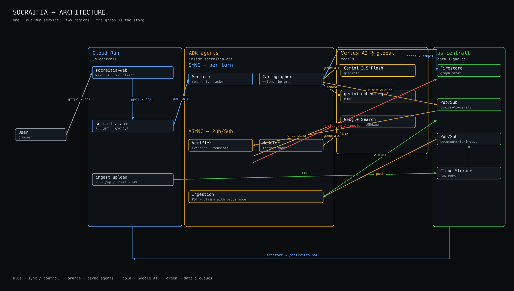
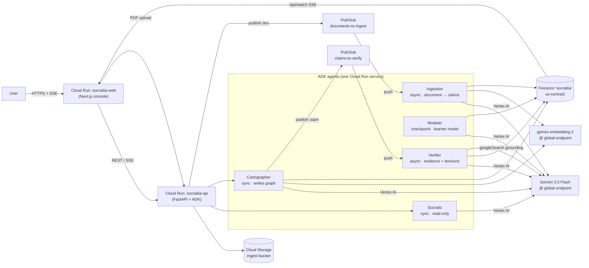

# Socraitia — an AI thinking partner, not an answer machine

**Track:** The Collaborative Partner
([All Things Agentic Hackathon](https://allthingsagentichackathon.devpost.com/))

**Live demo:** https://socraitia-web-424012738412.us-central1.run.app
**API (Cloud Run):** https://socraitia-api-424012738412.us-central1.run.app
**Repo:** https://github.com/rdbetancur/socraitia (public)
**Stack proof:** `./scripts/verify_stack.sh` — 7/7 checks against the live
Vertex API, ~15s. Run it before believing anything this README claims.

| Mandatory (every track) | What we ship |
| --- | --- |
| Gemini 3.5 or newer via Vertex AI | `gemini-3.5-flash` @ `global` — Socratic, Cartographer, Verifier, Modeler, Ingestion |
| A Google agent framework | Google ADK 2.8 (`LlmAgent` + `Runner` in `backend/app/agents/`) |
| A Google Cloud service | Cloud Run (web + api), Firestore, Pub/Sub, Cloud Storage |

This is not a chatbot. Five ADK agents take action on a persistent graph:
two sync (question + extract), three async (verify, ingest, model the
learner). The conversation is a side rail. **The graph is the product.**

---

## The problem

Deep intellectual work dies in dead notes. A researcher reads forty papers,
argues with themselves in a notebook, changes their mind three times — and
none of it accumulates into anything they can see. The notes app stores the
words and forgets the reasoning. Six weeks later the contradiction between
what they believed in March and what they believe now is invisible, because
nothing was keeping score.

Chatbots made this worse, not better. They answer instead of making you
think. Every conversation starts from zero, flatters your premise, and
evaporates when the tab closes. The tooling we have either stores text
without structure (notes) or produces text without memory (chat). Neither
treats your reasoning as an artifact worth building.

Socraitia is built on a different bet: **the graph is the product, not the
conversation.** You talk; it maps. Every claim, concept, question and
argument gap you produce becomes a typed node in a persistent knowledge
graph with typed relations between them. The system never answers your
question — it asks you one, and it remembers how you think across sessions,
well enough to confront you with the paper you uploaded last week that
disagrees with what you just said.

## What Socraitia does

- **Adaptive Socratic dialogue** — exactly one question per turn, calibrated
  to a persisted model of how you reason. Never lectures, never answers.
- **Autonomous graph construction** — a Cartographer agent extracts the
  structure of your argument from every exchange and mutates a live,
  force-directed graph in front of you.
- **Async verification** — every claim you make is queued to a Verifier that
  grounds it against Google Search and checks it against your own prior
  claims. Contradictions surface as glowing red edges — and as questions.
- **Document ingestion** — drop a PDF onto the canvas and it falls into the
  map: Gemini reads the paper natively, extracts its claims by section with
  full provenance, embeds them, and flags where the literature contradicts
  *you*.
- **Cross-project echoes** — a claim in your research project that rhymes
  with one in your product project writes a `connects_to` edge across the
  boundary. Serendipity, instrumented.
- **A learner model** — the system models *how* you think (reasoning style,
  blind spots, which question types land), evolves it every few exchanges,
  and adapts its questioning. Feedback buttons close the loop.
- **Node-anchored dialogue** — click any node, hit *Interrogate this*, and
  the dialogue focuses on that specific claim: its tensions, its evidence,
  its provenance.
- **The briefing** — open a project and the instrument reports what it found
  while you were gone: claims verified, sources retrieved, contradictions
  detected, echoes to other projects. Every line shows both claims in full
  with *Interrogate* attached. It is derived on read from node and edge
  timestamps, so it can never disagree with the graph. *Enter the map*
  dismisses it; **Briefing** in the topbar reopens the current state at any
  time. If nothing happened, the overlay stays silent.
- **The attention layer** — the canvas is a heatmap of where your thinking is
  unfinished. Nodes in open tension or marked as argument gaps are larger,
  warmly haloed, and always labelled; settled verified nodes recede and only
  speak when you zoom into them. The left panel leads with *Requires your
  attention* and then indexes every node, grouped by type, full text, with an
  instant filter. Panel and canvas are two views of one selection.

## Architecture





One backend service serves the API **and** the two Pub/Sub push endpoints.
One image, one IAM identity, one deploy — a second worker service would
double cold starts for no isolation we need at this scale.

### Agent roster

| Agent | Runs | Reads | Writes |
| --- | --- | --- | --- |
| **Socratic** | sync, every dialogue turn | graph summary, last 6 exchanges, learner model, tensions, echoes, focused node | nothing — it only asks |
| **Cartographer** | sync (concurrent with Socratic) | the exchange + graph context | nodes/edges diff, schema-constrained |
| **Verifier** | async, per claim (Pub/Sub push) | claim text, its embedding, the project's other claims, Google Search | evidence nodes, supports/contradicts edges, `verified` status |
| **Modeler** | every 3 exchanges + on session end | transcript, graph diffs, feedback tally | `users/{uid}.learner_model` (merge, never reset) |
| **Ingestion** | async, per document (Pub/Sub push) | raw PDF from GCS, via Gemini native document understanding | claims with provenance, cross-source contradicts edges |

The Socratic and Cartographer run **concurrently**, not in sequence — a
measured decision: ~4.3s to first token + ~8.5s extraction would cost ~13s
serialized, which is unusable live. They can overlap because the
Cartographer maps the user's message against the partner's *previous*
question, which is already known.

## Architecture decisions (the ones that matter)

**SHA-1 node identity.** A node's id is the SHA-1 of its normalized text.
One decision buys three properties: restatements merge instead of
duplicating (dedupe), Pub/Sub redelivery is a no-op (idempotency), and the
Cartographer can reference nodes by text while the store resolves them by
hash (edge resolution). The graph converges as it grows because identity is
content.

**Document-level ingestion idempotency.** Claim-level hashing is not enough
for re-uploads: two runs of the extractor can phrase the same finding
differently, which would fork the graph. So the SHA-1 of the file *bytes* is
the document id, and a re-upload is skipped before Gemini is called. Found
by testing, not by foresight — see Findings.

**Two-region reality, one config file.** Gemini 3.x is served **only** from
Vertex's `global` endpoint (us-central1 returns 404 — verified, and
`verify_stack.sh` re-asserts it). Firestore lives in us-central1. Every
model id and region lives in exactly one file, `backend/app/config.py`,
because model names rotate on the order of weeks and scattered identifiers
are a liability.

**Context strategy: the graph is the memory.** We never replay full
history. Each turn injects four bounded pieces: a hierarchical graph summary
(top-k by degree centrality), the last 6 exchanges verbatim, the learner
model as explicit directives, and open tensions. The artifact carries
long-term memory, so the prompt stays flat as a project grows across
sessions.

**In-memory cosine, with a stated boundary.** Similarity search (echoes,
contradiction candidates) runs as in-memory cosine over the owner's node
set. At hundreds of nodes that is microseconds and zero infrastructure; the
migration point to Vector Search is tens of thousands of nodes. A deliberate
trade-off, documented rather than hidden.

**Verification is for user claims, not literature.** Ingested paper claims
are born `active`; only the *user's* claims go through the Verifier. This is
an epistemic distinction, not a shortcut: the system verifies what you
assert, not what Bloom asserted in 1984. It also keeps the pending queue
honest — a pile of unverifiable literature would read as a stuck pipeline.

**The briefing is derived, never stored.** The one thing persisted for the
arrival state is a single `last_seen_at` watermark per project on the user
document. Everything the briefing reports is recomputed on read from
`created_at`, `verified_at`, `created_by_agent` and edge timestamps that
already exist. A stored digest would be a second source of truth about the
graph, and it would go stale the moment the Verifier wrote an edge. The
watermark advances only when the user dismisses (it drives the unread
badge). Reopening from the topbar fetches `?full=true` and does not depend
on rolling the watermark back.

**One derivation of "what matters".** Canvas, panel, dossier and briefing all
read node heat from `frontend/lib/attention.ts`; none of them computes it. If
three surfaces each decided independently which nodes were hot, they would
drift, and a map that disagrees with its own index is worse than no index.

**Contradiction detection scales across two mechanisms.** Empirically
observed in testing: in small graphs the Cartographer catches
contradictions via context (the conflicting claim is in the top-k summary);
in larger graphs the async Verifier catches them via embedding retrieval,
long after the original claim fell out of the context window. The demo
exercises both.

## Failure tolerance

| Path | Timeout | Retries | If it fails |
| --- | --- | --- | --- |
| Socratic / Cartographer | 60s | 2 | turn stays up; empty diff or error event |
| Embeddings | inherited | 1 | node exists without a vector; no echo |
| Pub/Sub publish | 8s | none | claim stays `verification_pending` |
| Verifier (search + polarity) | 45s | 2 | claim stays pending; graph remains usable |
| Ingestion (Gemini on PDF) | ack deadline 300s | platform redelivery | failed doc is a feed line, never a 500 |
| Pub/Sub redelivery | — | platform | SHA-1 ids + `verified_at` make it a no-op |

A claim without evidence is never a broken UI: the node draws a dashed ring
and the status bar counts `pending` until the Verifier stamps `verified` —
or never does. That is the degradation the demo is allowed to show.

## Security posture (hackathon scope, stated honestly)

- The backend is public because the frontend is; the Pub/Sub push endpoints
  are gated by a shared token in the URL query string. This is
  hackathon-scope: it stops casual abuse, not a motivated attacker.
- CORS is open (`*`) for the same reason.
- Identity is a fixed demo uid — there is no auth.
- Production hardening, enumerated as known next steps: OIDC-verified push
  subscriptions (Pub/Sub → Cloud Run service account) instead of a URL
  token, per-user auth with Firestore security rules, CORS restricted to the
  web origin, secret management via Secret Manager, and rate limiting at the
  API edge.
- IAM is least-privilege where it counts: the Cloud Run service account
  holds exactly `datastore.user`, `aiplatform.user`, `pubsub.publisher`,
  `pubsub.subscriber`, `storage.objectAdmin` — see `infra/iam_setup.sh`.

## Findings & learnings

- **ADK 2.x drifted from its own docs.** Constructor and streaming
  signatures in `google-adk` 2.8 do not match the published examples; we
  pinned the exact version and isolated every ADK touchpoint behind
  `agents/runtime.py` so the next signature change is a one-file fix.
- **Gemini 3.x region availability is real and enforced.** `global` only;
  us-central1 is a hard 404. The architecture is built around this, and
  `verify_stack.sh` asserts the 404 on purpose — if Google backfills the
  region, the check going green is the signal to revisit.
- **Latency forced concurrency.** A serialized Socratic→Cartographer turn
  measured ~13s. Running them concurrently against the *previous* question
  cut perceived latency to ~7s end-to-end. The dependency analysis (the
  Cartographer does not need the question being composed) was the real work.
- **The ingestion dedup bug.** Re-uploading the same PDF produced *new*
  nodes, because two extractor runs phrase the same finding differently and
  content-hash identity only merges identical text. Fixed with
  document-level idempotency (hash of bytes, skip before extraction). Found
  by explicitly testing the re-upload case; would have been a silent demo
  bug.
- **Native document understanding beat a parsing library.** Gemini reading
  the raw PDF handled two-column academic layout, figures and references
  without a single parsing dependency, and made section-aware chunking
  trivial — the model names the section each claim came from, which became
  our provenance.
- **Small graphs and large graphs contradict differently.** Same-session
  contradictions are caught by the Cartographer through context; delayed
  ones (3+ turns later, outside the window) are only caught by the async
  Verifier's embedding retrieval. Both were proven in testing before we
  believed either.

## Reproducible spin-up

Requires: Google Cloud SDK, Python 3.10+, Node 24, a GCP project with
billing.

```bash
git clone https://github.com/rdbetancur/socraitia.git && cd socraitia

gcloud auth application-default login
gcloud config set project <your-project>

# 0. Prove the model identifiers are real in YOUR project (7 checks, ~15s)
./scripts/verify_stack.sh

# 1. IAM: dedicated service account + least-privilege roles + API enablement
./infra/iam_setup.sh

# 2. Deploy both services (api first; its URL is baked into the web build)
./infra/deploy.sh

# 3. Seed the demo state (2 projects, learner model, echo pair, idempotent)
cd backend
python3 -m venv .venv && .venv/bin/pip install -r requirements.txt
.venv/bin/python scripts/seed_demo.py
```

Local development:

```bash
cd backend  && .venv/bin/python -m uvicorn app.main:app --port 8080
cd frontend && npm install && npm run dev        # http://localhost:3000
```

Useful scripts (`backend/scripts/`): `smoke_turn.py` (core loop, throwaway
project), `cloud_e2e.py` (deployed end-to-end), `seed_demo.py` (demo state),
`reset_learner_model.py` (wipe learner state), `reset_briefing.py` (optional
watermark rewind — the topbar Briefing button no longer needs it).

## Stack

Gemini 3.5 Flash (Vertex AI, global endpoint) · Google ADK 2.8 ·
gemini-embedding-2 · Firestore (us-central1) · Cloud Run · Pub/Sub · Cloud
Storage · Next.js. No non-Google infrastructure.

**Other data sources:** the Verifier grounds user claims against **Google
Search** (`google_search` ADK tool). Ingested claims come from PDFs the
user drops onto the canvas. No third-party APIs.

---

## Hackathon submission (judges)

Mapped 1:1 to
[What to Submit](https://allthingsagentichackathon.devpost.com/).

| Devpost field | Answer |
| --- | --- |
| Category | **The Collaborative Partner** |
| Hosted project | https://socraitia-web-424012738412.us-central1.run.app |
| Code repository | https://github.com/rdbetancur/socraitia (public — no collaborator invite needed) |
| Architecture diagram | [`docs/architecture.png`](docs/architecture.png) and the Mermaid above |
| Spin-up | this README, section *Reproducible spin-up* |
| Findings and learnings | this README, section *Findings & learnings* |
| Technologies | Gemini 3.5 Flash, Google ADK, Vertex AI, Cloud Run, Firestore, Pub/Sub, Cloud Storage, Next.js |
| Other data sources | Google Search (Verifier grounding); user-uploaded academic PDFs |

**Why this track.** The brief is: *lead the way and take notes; ask
clarifying questions; guide step-by-step; capture feedback; adapt to the
user's unique way of thinking.* That is the Socratic agent + learner model
+ `this helped` / `this missed`. The async Verifier, PDF ingestion and
briefing are the 40% *operational utility* — the partner that keeps working
after the tab closes — not a second track.

We do **not** claim The Fortified Enterprise Fleet (no Agent Registry,
Model Armor, or enterprise identity). We do **not** claim the Gemma / Veo /
Lyria bonus; the classification task stayed inside the Cartographer.

---

*Architecture deep-dive: [docs/ARCHITECTURE.md](docs/ARCHITECTURE.md) ·
Region measurements: [docs/verification-log.md](docs/verification-log.md)*
